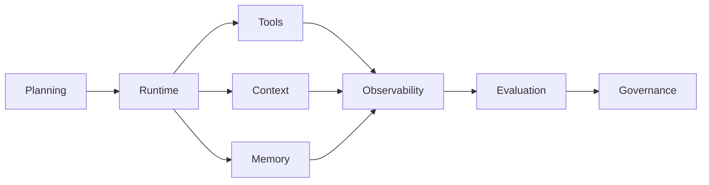
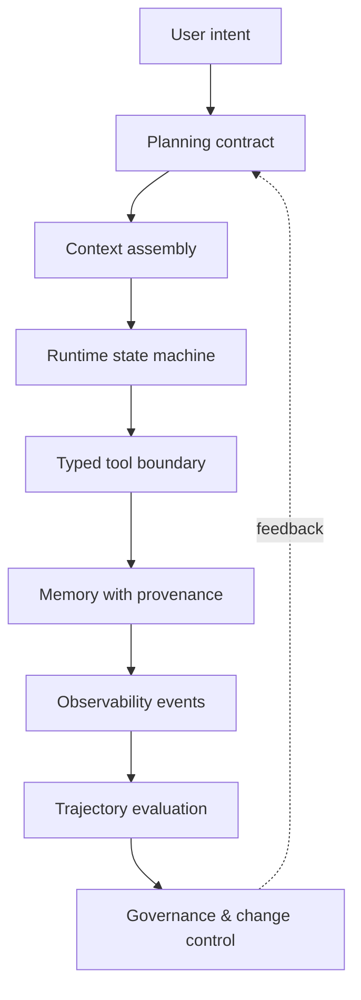

# Agent Engineering Notes

> Practical notes on building reliable agent systems—from tool contracts to runtime governance.

[中文导读](./README.zh-CN.md)

This repository organizes my study and engineering notes around a single question: **what makes an agent dependable beyond a demo?**

## Innovation focus

This is not a link collection. Each note connects four layers that are often discussed separately:

> **contract → runtime failure → observable signal → evaluation method**

That structure turns abstract agent concepts into engineering decisions that can be reviewed and tested.

## Knowledge map

| Topic | Core question | Status |
| --- | --- | --- |
| [Agent architecture](./notes/01-agent-architecture.md) | How should responsibilities be separated? | Seed note |
| [Tool calling](./notes/02-tool-calling.md) | How do tools remain predictable and inspectable? | Seed note |
| [Context engineering](./notes/03-context-engineering.md) | What belongs in the working context? | Seed note |
| [Memory](./notes/04-memory.md) | What should persist, and with what provenance? | Seed note |
| [Evaluation](./notes/05-evaluation.md) | How do we measure trajectories, not only answers? | Seed note |
| [Agent Runtime](./notes/06-agent-runtime.md) | How are probabilistic plans converted into bounded transitions? | Engineering note |
| [RAG](./notes/07-rag.md) | How is evidence retrieved, routed, and cited? | Engineering note |
| [Multi-Agent Systems](./notes/08-multi-agent-systems.md) | When does another agent create a useful boundary? | Engineering note |
| [Agent Self-Evolution](./notes/09-agent-self-evolution.md) | How can experience become governed knowledge? | Engineering note |

## Reliability stack

The stack is deliberately cyclic: evaluation findings should change contracts through a governed process, not by silently appending prompts.

## Suggested reading paths

| Goal | Path |
| --- | --- |
| Build a first reliable agent | Architecture → Tool calling → Context engineering |
| Debug long conversations | Context engineering → Memory → Evaluation |
| Design an agent platform | Architecture → Runtime → Observability → Governance |
| Study self-improvement | Evaluation → Memory → Skill evolution |

## Note template

Every mature note aims to answer:

1. What contract or invariant should hold?
2. How does it fail in a real trajectory?
3. Which event makes the failure observable?
4. What is deterministic, and what remains probabilistic?
5. How can the behavior be evaluated or replayed?
6. What evidence would change the recommendation?

## Cross-topic failure matrix

| Symptom | Likely layer | First diagnostic question |
| --- | --- | --- |
| Correct tool, wrong arguments | Planning / tool contract | Was the schema explicit and validated? |
| Good early answer, degraded follow-up | Context / memory | Which evidence was dropped or promoted? |
| Repeated tool loop | Runtime | Is there a bounded transition and stop condition? |
| Fluent but unsupported conclusion | Retrieval / evaluation | Can the claim be traced to source evidence? |
| Fix improves one case, breaks another | Governance | Was the change condition-preserving and regression-tested? |

## Writing principles

- Separate observations, hypotheses, and established findings.
- Prefer runnable examples and explicit failure modes.
- Link claims to public papers, documentation, or reproducible experiments.
- Never include confidential code, data, screenshots, prompts, or metrics.

## Next sections

Coding Agents · Agent observability · Safety and Governance · Evaluation datasets

## License

Text: CC BY 4.0. Code snippets: MIT.
