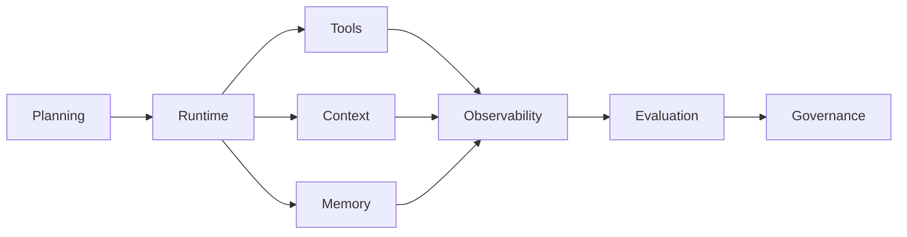

# Agent Engineering Notes

> Practical notes on building reliable agent systems—from tool contracts to runtime governance.

[中文导读](./README.zh-CN.md)

This repository organizes my study and engineering notes around a single question: **what makes an agent dependable beyond a demo?**

## Knowledge map

| Topic | Core question | Status |
| --- | --- | --- |
| [Agent architecture](./notes/01-agent-architecture.md) | How should responsibilities be separated? | Seed note |
| [Tool calling](./notes/02-tool-calling.md) | How do tools remain predictable and inspectable? | Seed note |
| [Context engineering](./notes/03-context-engineering.md) | What belongs in the working context? | Seed note |
| [Memory](./notes/04-memory.md) | What should persist, and with what provenance? | Seed note |
| [Evaluation](./notes/05-evaluation.md) | How do we measure trajectories, not only answers? | Seed note |

## Writing principles

- Separate observations, hypotheses, and established findings.
- Prefer runnable examples and explicit failure modes.
- Link claims to public papers, documentation, or reproducible experiments.
- Never include confidential code, data, screenshots, prompts, or metrics.

## Planned sections

Agent Runtime · RAG · Multi-Agent Systems · Coding Agents · Agent Self-Evolution · Safety and Governance

## License

Text: CC BY 4.0. Code snippets: MIT.
