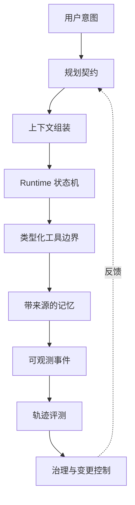

# Agent Engineering Notes

[English](./README.md)

围绕“如何让 Agent 从 Demo 走向可靠系统”整理的工程笔记，覆盖架构、工具调用、上下文、记忆、评测与治理。

## 创新焦点

这不是链接收藏，而是用一条固定主线连接经常被割裂讨论的四层内容：

> **契约 → Runtime 故障 → 可观测信号 → 评测方法**

每篇成熟笔记最终都应落到可以审查、诊断和验证的工程决策。

## 内容原则

- 区分观察、假设和已有结论。
- 优先记录可运行示例与明确失败模式。
- 重要结论链接公开论文、官方文档或可复现实验。
- 不包含任何内部代码、数据、截图、提示词或指标。

## 知识地图

| 主题 | 核心问题 | 入口 |
| --- | --- | --- |
| Agent 架构 | 职责如何拆分？ | [阅读](./notes/01-agent-architecture.md) |
| 工具调用 | 工具如何保持可预测、可检查？ | [阅读](./notes/02-tool-calling.md) |
| 上下文工程 | 哪些信息应该进入工作上下文？ | [阅读](./notes/03-context-engineering.md) |
| Memory | 什么值得持久化，来源如何保留？ | [阅读](./notes/04-memory.md) |
| Agent 评测 | 如何评估轨迹，而不只比较答案？ | [阅读](./notes/05-evaluation.md) |
| Agent Runtime | 如何把概率计划转化为有界状态转移？ | [阅读](./notes/06-agent-runtime.md) |
| RAG | 如何检索、筛选并引用证据？ | [阅读](./notes/07-rag.md) |
| 多智能体系统 | 什么时候增加 Agent 才能形成有效边界？ | [阅读](./notes/08-multi-agent-systems.md) |
| Agent 自我演化 | 如何把经验交付成受治理知识？ | [阅读](./notes/09-agent-self-evolution.md) |

## 可靠性技术栈

## 推荐阅读路径

| 目标 | 阅读顺序 |
| --- | --- |
| 构建第一个可靠 Agent | 架构 → 工具调用 → 上下文工程 |
| 排查长会话退化 | 上下文工程 → Memory → 评测 |
| 设计 Agent 平台 | 架构 → Runtime → 可观测性 → 治理 |
| 研究 Agent 自我改进 | 评测 → Memory → Skill 演化 |

## 统一笔记模板

1. 需要维持什么契约或不变量？
2. 它在真实轨迹中如何失败？
3. 哪个事件使故障可观测？
4. 哪部分可以确定性执行，哪部分仍是概率判断？
5. 如何评测或回放该行为？
6. 什么新证据会改变当前结论？

## 跨主题故障矩阵

| 表现 | 可能层级 | 首要诊断问题 |
| --- | --- | --- |
| 工具正确、参数错误 | 规划/工具契约 | Schema 是否明确并完成校验？ |
| 首轮正确、追问退化 | 上下文/记忆 | 哪段证据被丢弃或错误升级？ |
| 重复工具循环 | Runtime | 是否存在有界状态转移和停止条件？ |
| 结论流畅但无依据 | 检索/评测 | 结论能否追溯到来源证据？ |
| 修好一个案例却破坏其他案例 | 治理 | 变更是否保留条件并完成回归测试？ |
