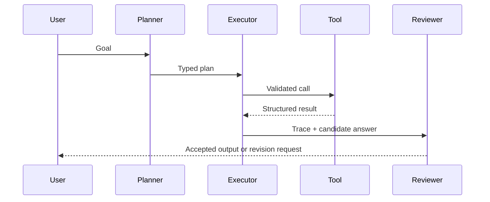

# 01 · Agent Architecture

## Working model

An agent system is easier to reason about when planning, execution, state, and review have explicit boundaries.

## Failure modes

- Planner emits actions that no tool can execute.
- Executor retries without reading changed state.
- Reviewer sees only the final answer and misses a dangerous trajectory.
- Shared mutable state makes failures hard to reproduce.

## Design checklist

- Are component inputs and outputs typed?
- Is every side effect recorded with an event ID?
- Can the reviewer cite the evidence behind a decision?
- Is there a deterministic stopping condition?
