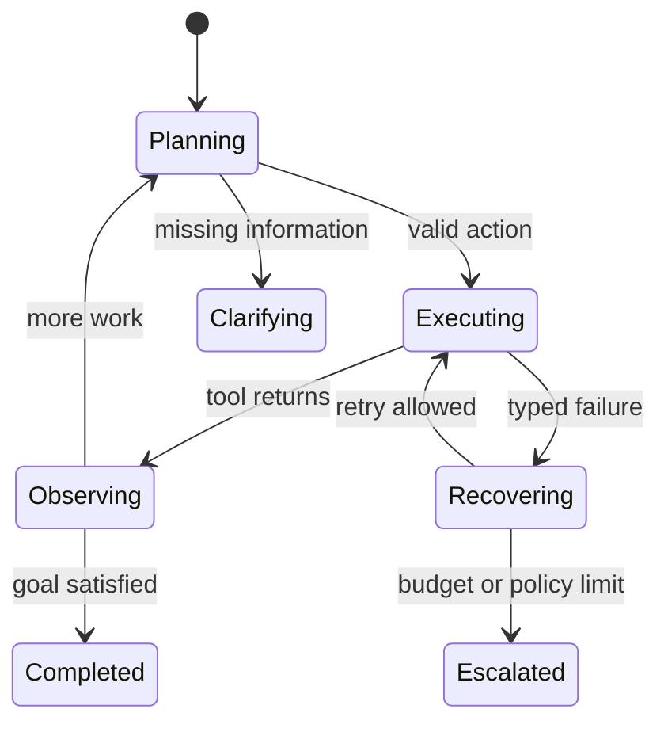

# Agent Runtime

An agent runtime turns probabilistic plans into bounded state transitions.

## Core contract

At every step the runtime should know:

- current state and allowed next states;
- tool call identity, arguments, timeout, and retry policy;
- which events are persisted;
- which budget is being consumed;
- what constitutes completion, failure, or escalation.

## State model

## Failure modes

| Failure | Runtime defense |
| --- | --- |
| Infinite tool loop | Transition count and semantic repetition budget |
| Duplicate side effect | Idempotency key and execution receipt |
| Hidden partial failure | Typed result envelope with explicit status |
| Lost continuation | Persisted checkpoint and resumable event cursor |
| Planner ignores policy | Validate action before dispatch |

## Observability events

Prefer structured events such as `plan.created`, `tool.started`, `tool.completed`, `state.changed`, `budget.exhausted`, and `run.finalized`. Logs explain implementation; events explain behavior.

## Evaluation questions

- Can every side effect be traced to an approved action?
- Can a failed run resume without repeating completed effects?
- Does every loop have a budget and terminal state?
- Can an evaluator reconstruct the trajectory from events alone?
