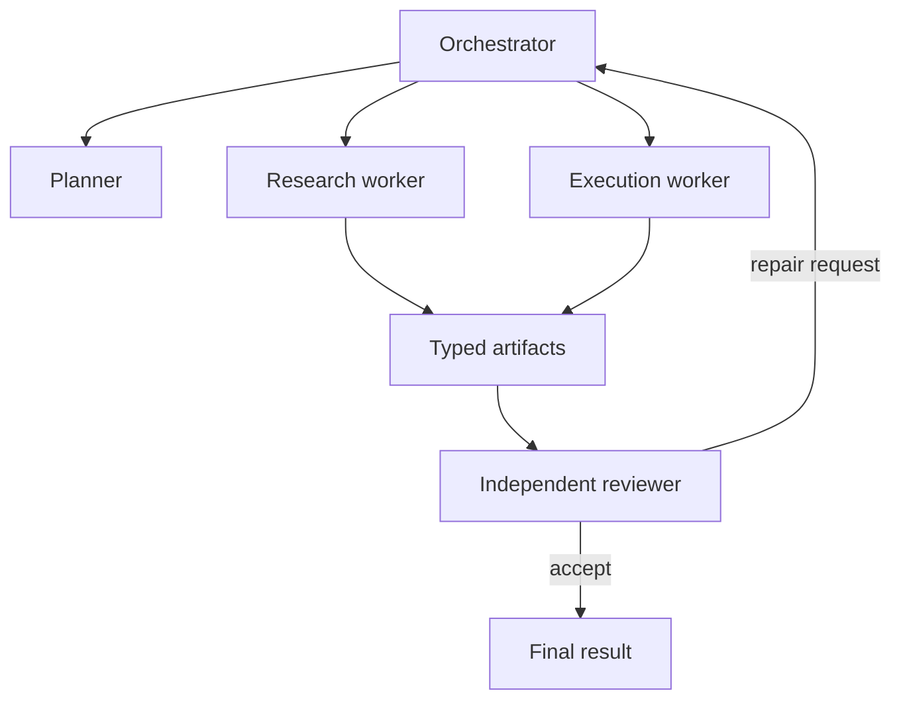

# Multi-Agent Systems

Multiple agents are useful when they create enforceable boundaries—not when they merely duplicate prompts.

## When decomposition helps

- Different roles need different tools or permissions.
- Work can proceed independently and merge through a clear contract.
- A reviewer must remain isolated from the producer's hidden reasoning.
- Context would otherwise become too broad for one bounded worker.

## Coordination model

## Required contracts

| Boundary | Contract |
| --- | --- |
| Delegation | Objective, scope, inputs, budget, expected output |
| Tool access | Least privilege per role |
| Handoff | Typed artifact instead of conversational implication |
| Merge | Conflict and ownership policy |
| Review | Independent criteria and repair limit |

## Failure modes

- Agents repeat the same work because ownership is unclear.
- Handoffs lose evidence and preserve only conclusions.
- Reviewer shares the producer's assumptions and misses systematic errors.
- Parallelism increases cost without reducing critical-path latency.

Start with one agent. Add another only when the boundary can be named, enforced, and evaluated.
