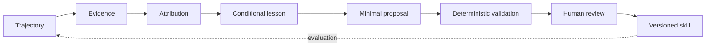

# Agent Self-Evolution

Self-evolution should be treated as governed knowledge delivery, not autonomous prompt mutation.

## Learning loop

## Three separations

1. **Trace vs. knowledge:** an event is evidence, not automatically a rule.
2. **Reasoning vs. authority:** a model may propose; policy controls writes.
3. **Adoption vs. permanence:** accepted guidance remains subject to regression evidence.

## Admission checklist

- Is the failure independently supported?
- Does the lesson preserve its triggering condition?
- Is there one clear existing owner?
- Does the proposal duplicate or conflict with current guidance?
- Can the rule be understood without private context?
- Is there a positive case, negative case, and rollback path?

## Useful rejection reasons

`insufficient_evidence` · `duplicate_existing` · `ownership_conflict` · `overfitted_example` · `privacy_risk`

Explicit rejection is a feature: it keeps the knowledge base smaller, more coherent, and easier to trust.
